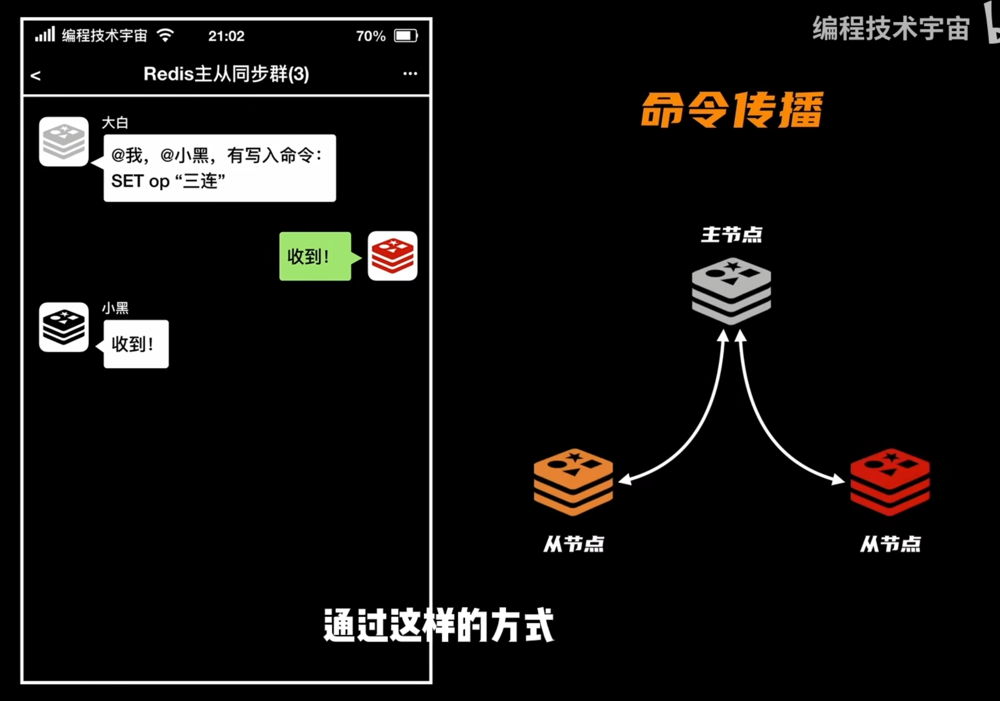
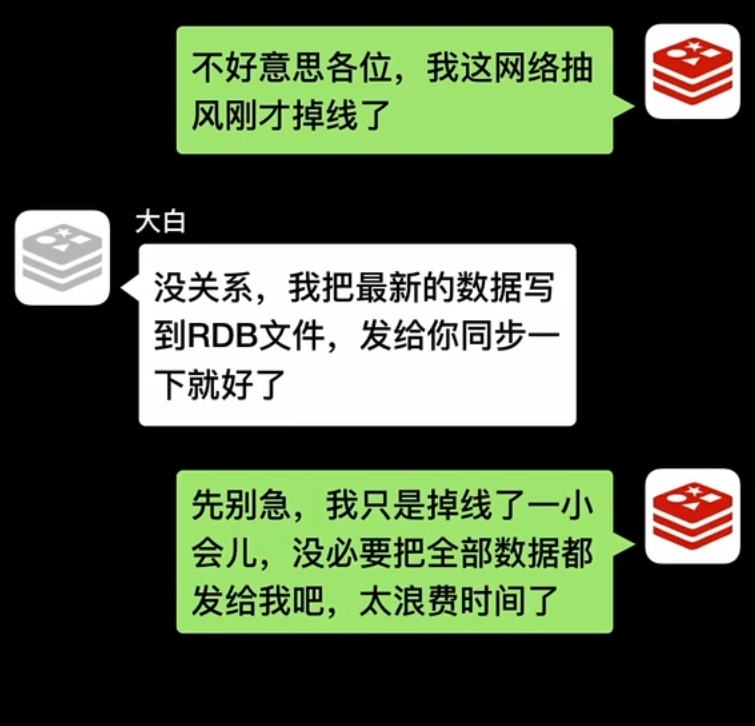
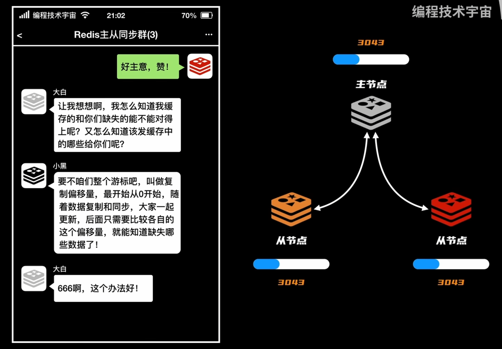
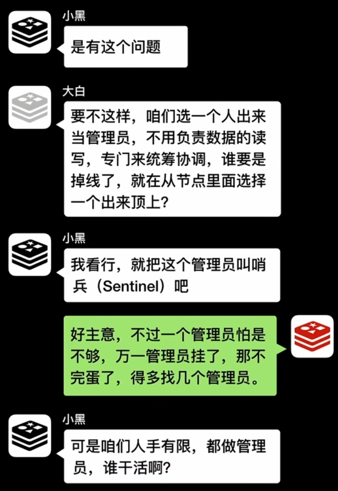
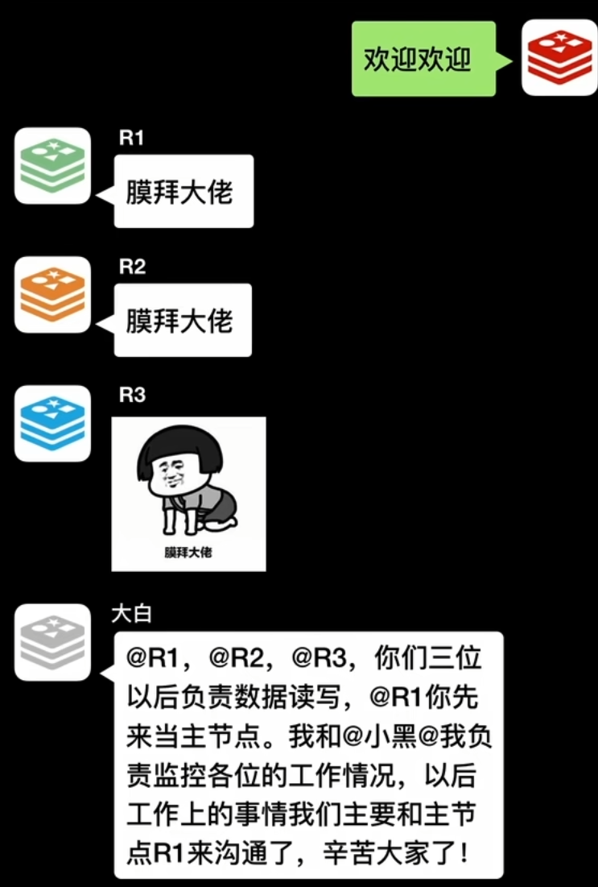
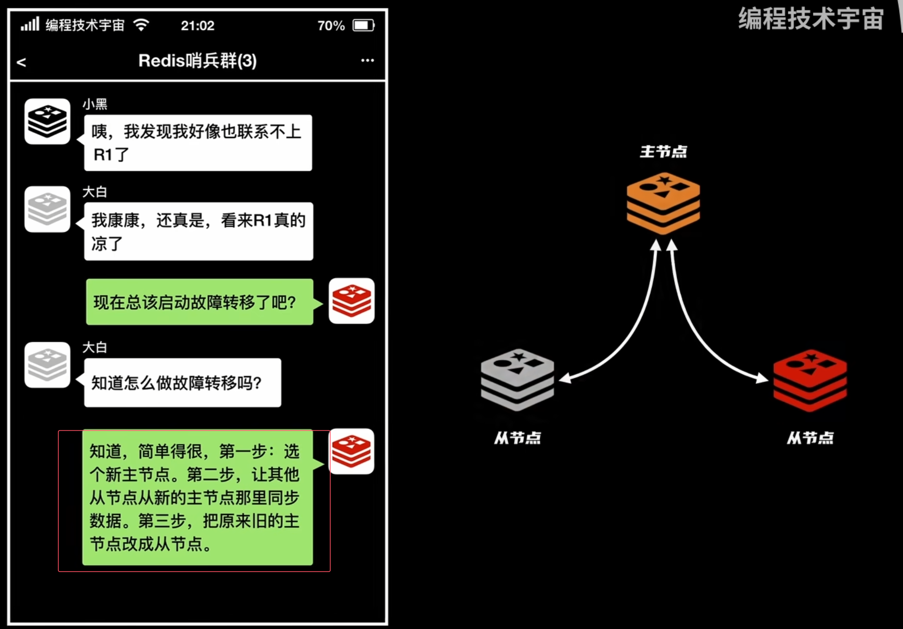
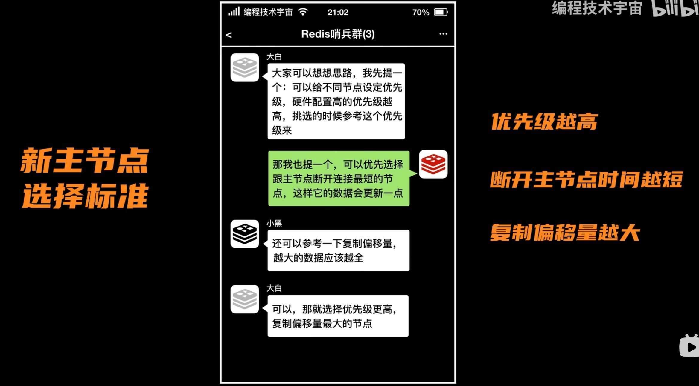

### 主从节点保证高可用
通过主节点和从节点，
主节点负责数据写入和同步，从节点负责读取

#### 命令传播
主节点将收到的命令，传播给子节点，保障数据同步。

如果从节点掉线了，主节点将RDB文件发给从节点进行恢复，会消耗大量的时间。
有什么办法可以让从节点仅恢复掉线这一会的数据呢？

#### 复制偏移量  
主节点准备一个，更新命令的缓冲区（一段时间内都做了哪些增删改查操作），通过复制偏移量，同步节点的更新情况。

### 哨兵
哨兵，要每一秒中检查，检查主从节点的存活情况。  

为了防止哨兵出现误判，当有一个哨兵发现主节点下线后，此时为主观下线。  
需要通知其他哨兵，当多数哨兵判断主节点下线后才被判定为客观下线。  

### 故障转移
如何进行故障转移？
  
如何选取主节点？
  