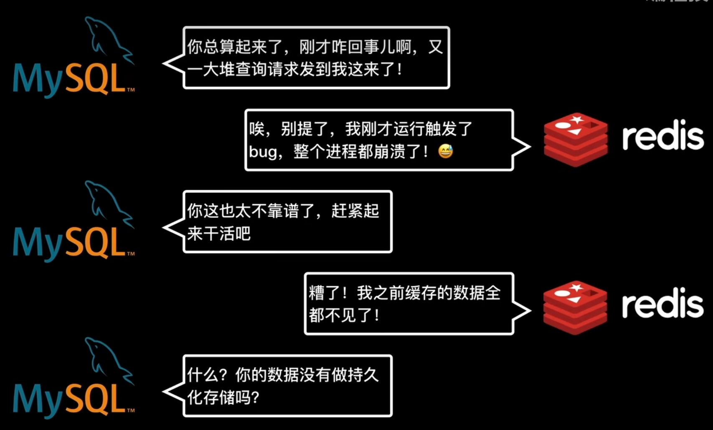
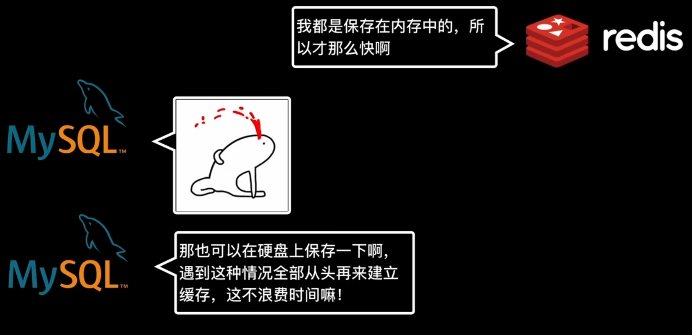
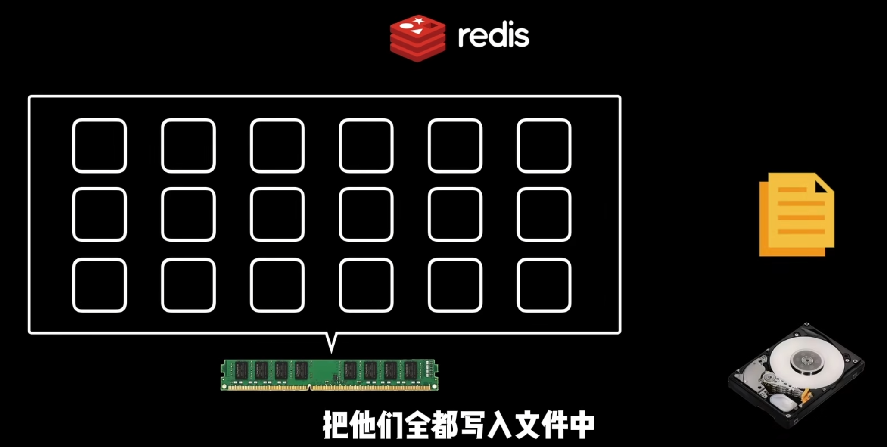
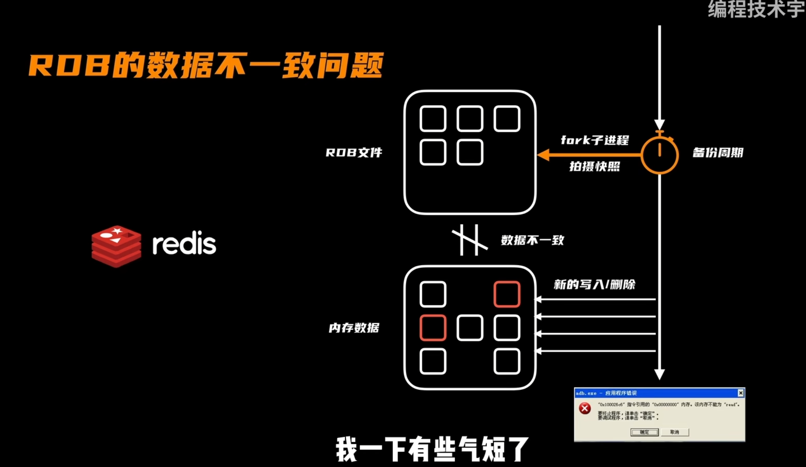
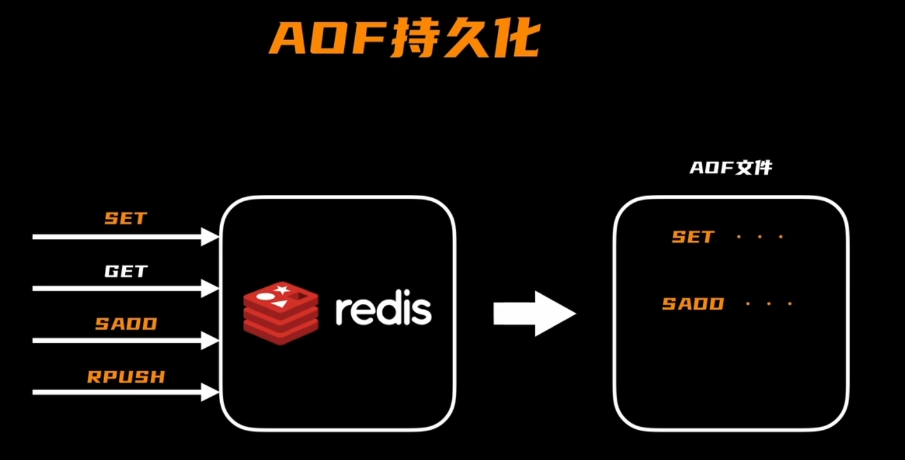
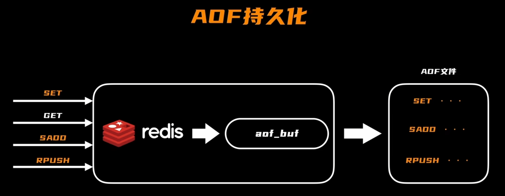
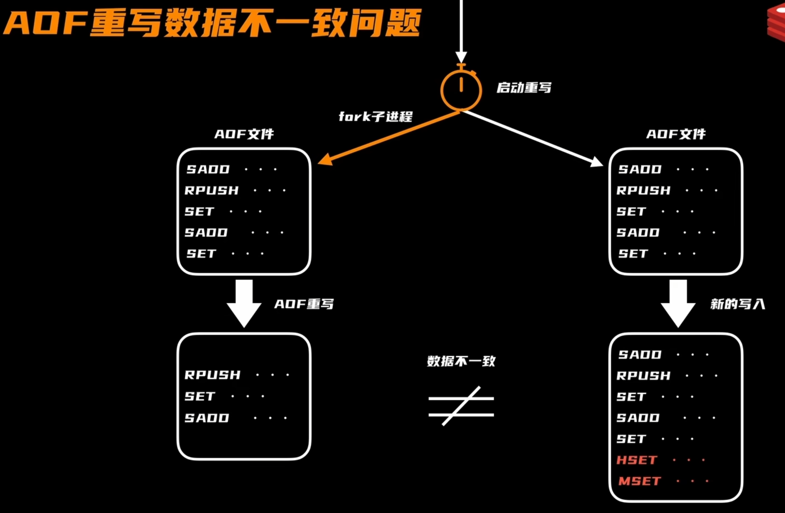
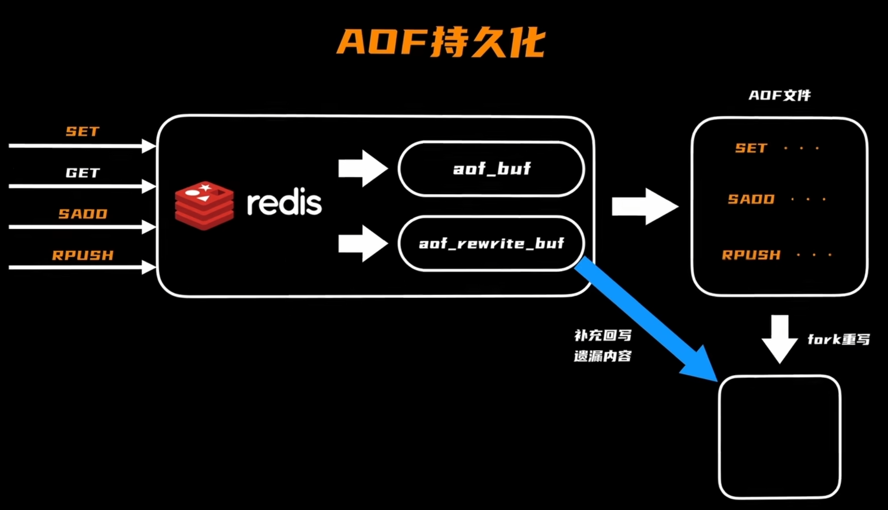

当redis不小心挂掉时，内存中的数据全部丢失，就需要redis将缓存持久化到硬盘中，当redis挂掉时，就从硬盘中的持久化数据中恢复redis缓存

  
  
 
### RDB持久化

如果都是读取操作，而没有写入操作，则不需要重复备份。
  
  
配置参数，用来周期性将redis缓存，存储到RDB文件中。
  

由于redis的缓存更新可能比较频繁，但是持久化的周期远远长于redis缓存的更新，就会存在RDB数据不一致问题。  
  

### AOF持久化
将更改后的指令存储到AOF文件中，用来恢复redis缓存，这样就不需要将缓存数据写道磁盘里保存了，可以通过日志文件将缓存区恢复。  
  
由于频繁的将指令写入到AOF文件中，会影响redis的访问性能，需要将访问更改指令存储到aof_buf缓冲区中，择机将缓冲区的数据持久化到
aof文件中。  

#### AOF重写
将原来的指令进行合并，减少aof文件大小。  

AOF创建子进程，进行AOF重写，会导致AOF文件不一致。  
  
在AOF重写进程进行重写时，增加一个aof_rewrite_buf，将redis主进程中的aof重写也记录下来，然后一并提到到重写后的aof文件中
