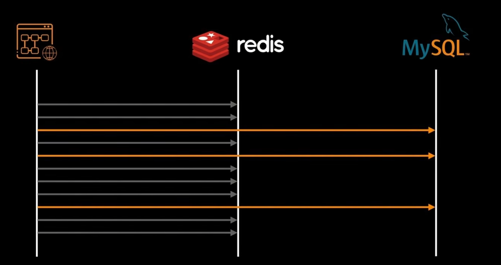
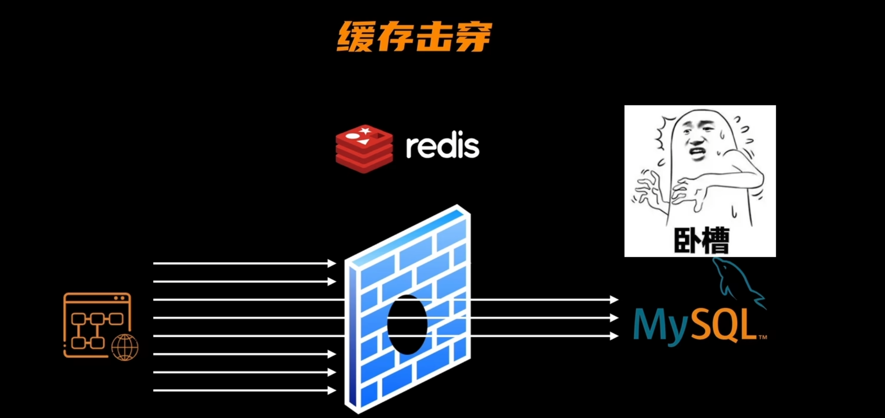
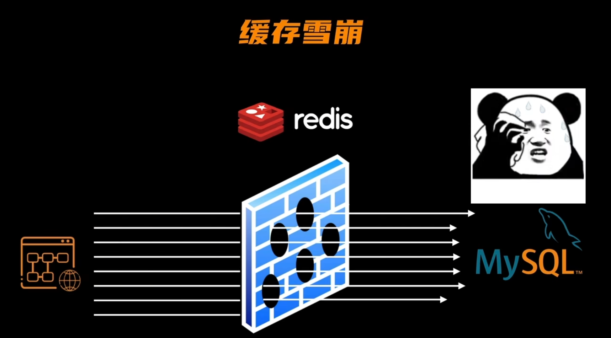

### 定时删除
由于内存有限，需要对每个内容设置一个生存时间  

但并不是所有生存时间到期的内容都会被删除，而是采用随机算法对过期内容进行删除，就会导致有一部分过期数据
很长时间不会被清理。  

### 惰性删除
用户发起的请求，当redis发现请求内容已经过期时，就进行删除  

### 内存淘汰策略
  

### 缓存穿透
当用户访问时访问不存在的数据，由于redis不能缓存不存在数据，这次请求必定会穿透redis缓存，
让mysql数据库进行处理!这种不存在数据库中的查询信息，将会导致mysql性能下降  
[img_7.png](img_7.png)

### 缓存击穿
当redis缓存中的热点数据，过了生存周期，被删除时，用户这个时候发起大量对热点数据的请求，就造成了缓存击穿现象。
在应用层设置热点数据永不过期，用来解决缓存击穿问题。
  
  

### 缓存雪崩
当出现大量的热点数据，同时超过生存周期被删除，就造成了缓存雪崩现象，对每个内容随机生存周期，防止大量热点数据同时过期。  
  
  
